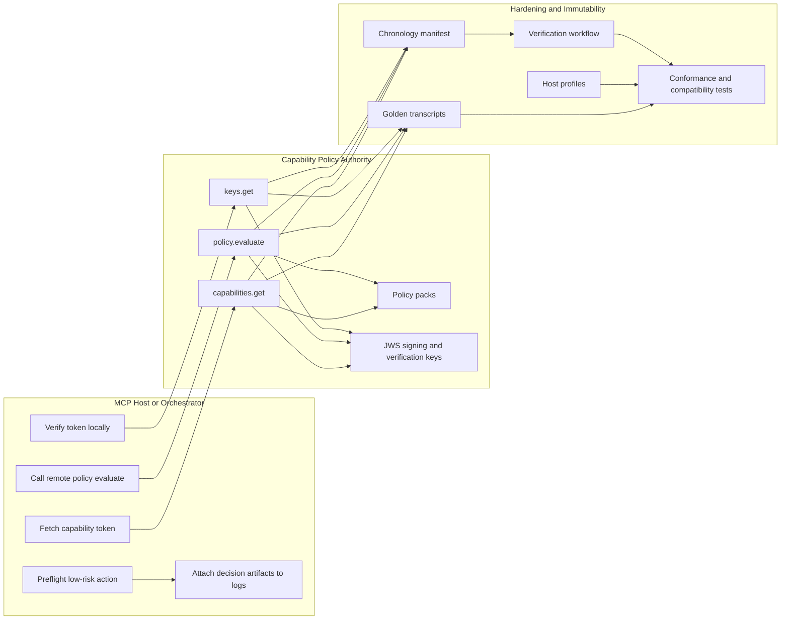

# Architecture

## One-screen model

This repository exposes a thin, evaluate-only MCP-native layer:

- `capabilities.get`
- `policy.evaluate`
- `keys.get`

It exists to let an MCP host or orchestrator:

1. fetch a short-lived capability token
2. verify it locally
3. locally preflight covered low-risk actions
4. remotely evaluate uncovered or approval-gated actions
5. attach decision artifacts to its own logs, traces, or receipts

In v0.2 the runtime is explicit:

- reference mode backs fixtures, transcripts, docs, and the packaged CLI
- runtime mode requires explicit clock, issuer, key, and pack-store configuration

## Diagram

Source: [architecture.mmd](./architecture.mmd)

## How it works

- `capabilities.get` issues a short-lived capability token for an orchestrator mission context.
- `keys.get` publishes offline verification material.
- `policy.evaluate` returns a deterministic policy result for a normalized action descriptor.
- authority construction is explicit in runtime mode and deterministic in reference mode
- transport lifecycle is modeled as a session state machine instead of informal booleans

## Why this stays narrow

This layer is intentionally not:

- an orchestrator
- a secret broker
- a payment layer
- a workflow engine

Its job is evaluation and attestation only.

## Truth sources

This explainer is valid only insofar as it matches the current repo truth:

- transcripts: [docs/transcripts](./transcripts)
- host profiles: [docs/host-profiles](./host-profiles)
- chronology: [docs/chronology](./chronology)
- verification workflow: [docs/verification-workflow.md](./verification-workflow.md)

If any of those change, this explainer must change with them.
